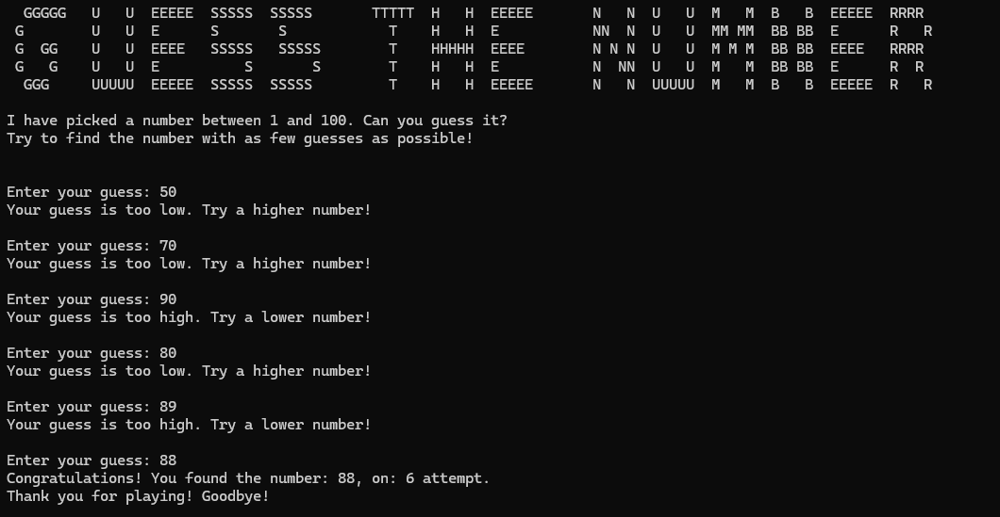

# Number Guessing Game

## Description

This is a simple number guessing game implemented in C++. The program generates a random number between 1 and 100, and the user needs to guess the number. After each guess, the program will tell the user whether the guess is too high, too low, or correct.

### Screenshot

Below is a screenshot of the game in action:

### How to Play

1. The program generates a random number between 1 and 100.
2. You need to guess the number by inputting your guess.
3. If your guess is too high, the program will prompt you to try a lower number.
4. If your guess is too low, the program will prompt you to try a higher number.
5. The game continues until you guess the correct number.

## How to Run

1. Clone the repository.
2. Open the project in your favorite C++ IDE or compiler.
3. Compile and run the program.
